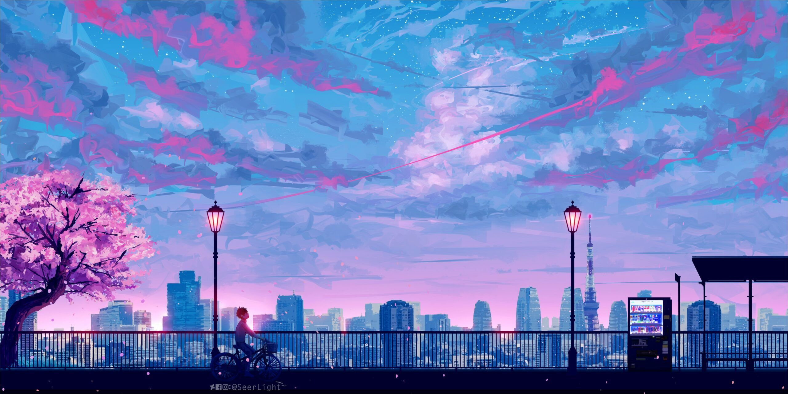
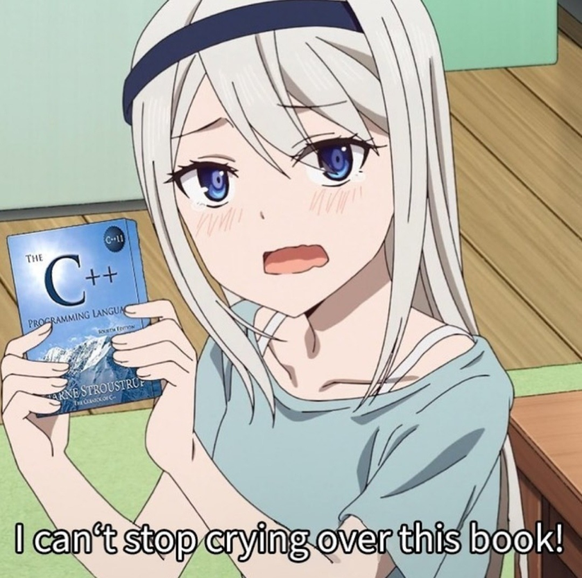

Hi 👋 My name is Ivan
=====================

Software trainee
----------------

I'm studying programming at St. Petersburg State University and I dream of becoming a cool specialist. In my free time I like to learn new things and play basketball.

* 🌍  I'm based in Saint-Petersburg
* ✉️  You can contact me at [https://t.me/pepe2head](mailto:https://t.me/pepe2head)
* 🧠  I'm learning Flutter/dart
* 🤝  I'm open to collaborating on interesting projects

### Skills

### Socials

### Badges

<a href="https://t.me/pepe2head" target="_blank" rel="noreferrer"></a

  

